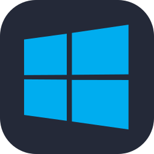
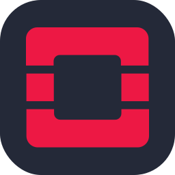
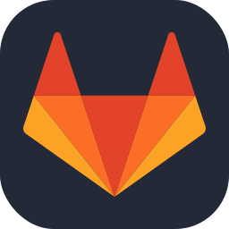
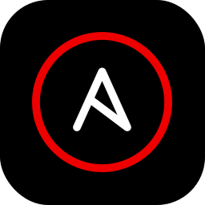

# 職務経歴書

---

|最終更新日|
|----|
|2026年4月14日|

## 基本情報

|項目|内容|
|----|----|
|名前|H. R.|
|居住地|■■県■■市|
|最終学歴|■■大学 ■■学部 ■■学科|

## 職務要約

2017年7月に株式会社Ａに入社し、主にオンプレミス環境におけるサーバの構築・運用保守業務に従事してまいりました。特に、通信業界の大規模ネットワークインフラや金融業界のサーバシステム維持管理において、障害対応や手順検討、保守作業などを担当し、安定稼働に貢献してまいりました。また、社内では、新人向けの簡単なサーバ構築研修の作成に携わり、技術のアウトプット等にも努めて参りました。

2023年2月より株式会社Ｄに転職し、Google Cloudを活用したマルチテナント型共通インフラ基盤の構築やデータ利活用基盤の整備にも携わり、Infrastructure as Code (IaC)の導入や運用監視設計など、モダンなクラウドインフラの構築・運用にも従事しておりました。常に新しい技術の習得に努め、チーム内外と連携しながらプロジェクトを推進してまいりました。

## 資格

- Google Cloud (PCA,PCD,PCDE,PCSE,ACE,AGWA,CDL)
- AWS SAA (2022/10取得 失効済)
- LinuC 304(2020/03取得 失効済)
- CCNP(2019/12取得 失効済)

## スキルセット

### OS

RedHat・Ubuntu・Debian・Windows

   

### クラウド

#### Google Cloud

GCE・GKE・Cloud Storage・Filestore・Spanner・AlloyDB・Pub/Sub・Logging・Monitoring・
Cloud Run・Cloud DNS・OpS Agent

### ミドルウェア

Apache・Squid・OpenStak・Datadog

   

### 言語

Bash

### その他ツール

Git・Gitlab・Docker・Terraform・Ansible

    

## 職務経歴

|所属|時期|
|----|----|
|株式会社Ｄ | 2023/2〜2025/11 |
|株式会社Ａ | 2017/7〜2023/1 |

|期間|案件内容|開発環境|役割・規模|
|----|----|----|----|
|2023年7月〜2025年11月|(大手小売業)  グループ共通基盤およびデータ利活用基盤の構築・運用  【概要】 グループ全体のシステム開発の標準化・迅速化を目的としたマルチテナント型の共通インフラ基盤（Google Cloud）の構築、および大規模データの利活用を支える分析基盤の整備に従事。 詳細設計から構築、テスト、運用までを一貫して担当。  【担当業務】 ・GKE、Cloud Runを中心としたコンテナ実行基盤の詳細設計・構築 ・Cloud Spanner、AlloyDBを用いた高可用性データベース基盤の設計・構築 ・Terraform・Ansibleを用いたInfrastructure as Code (IaC)による環境の自動生成・構成管理 ・Cloud Monitoring / Loggingを活用したSLI/SLOに基づく運用監視設計 ・OSセキュリティ要塞化 (Hardening):RHELに対し、CIS Benchmarkに準拠したAnsible Playbookを用いて調査・適用を実施。 ・マネジメント業務: 案件参画に伴う工数見積もり、スケジュール調整、リソース管理を担当。  【成果】 大規模システムにおけるインフラ標準化により、属人性を排除した「メンテナンス性の高い基盤」を実現。IaCの徹底により、手動作業による設定ミスを未然に防ぎ、システムの堅牢性向上に寄与しました。 RHEL基盤のセキュリティ品質向上のため、CIS Benchmarkに準拠したAnsible Playbookを用いた自動調査（Dry-run）プロセスを導入しました。手動では膨大な時間を要する数百項目のセキュリティ診断を自動化したことで、確認工数を大幅に削減しつつ、設定の不備や脆弱な箇所を網羅的に可視化しました。|【OS】 RedHat 【クラウド】 GCE GKE Cloud Spanner AlloyDB Cloud Run Cloud Storage Cloud Monitoring Cloud Logging 【ミドルウェア】 Apache Squid OpS Agent 【その他ツール】 Gitlab Terraform Ansible|メンバー→サブリーダー/設計・構築・運用 3名 |
|2023年2月〜2023年6月|(FinTech系)  次世代デジタルプラットフォーム基盤構築  【概要】 Google Cloud上で提供しているプロジェクトにおいて、そのインフラ基盤の信頼性を高めるため、インフラ基盤整備、アプリチームがより効率的に作業できるようにツール作成や基盤システムの可視化を実現するSREメンバとして本プロジェクトへ本プロジェクトへ参画  【担当業務】 ・GKEのバージョンアップに伴う影響調査および移行計画の策定（PodSecurityPolicy廃止への対応等） ・Datadog費用削減対応 ・Google Apps Script (GAS) を活用した、Google Chat連携型のTerraform実行承認ツールの開発 【成果】 ・GKEアップグレード時のAPI非互換による障害を未然に防ぎ、無停止での移行プロセスを確立。 ・監視コスト（Datadog）を精査し、運用要件を維持したまま月額コストの削減に寄与。 ・チャットベースの承認フロー導入により、インフラ変更時のヒューマンエラー防止と承認作業のリードタイム短縮を実現。|【OS】 Debian 【ミドルウェア】 Datadog 【クラウド】 GKE Cloud Storag Cloud Run 【その他ツール】 Gitlab|メンバー/SRE 10名|
|2021年3月〜2023年1月|(通信業界)  サーバ構築業務/保守業務 【概要】 SaaSで運営しているサーバをOpenStack環境上に再構築し、構築後は保守フェーズで問い合わせ対応やパッチ調査に従事。  【担当業務】 ・設計検討、構築（社内検証環境） ・試験項目作成および実施 ・試験用ツール作成（ShellScript） ・運用手順書などの作成 ・運用自動化（Bat作成）  【成果】 チーム内にOpenStack有識者が不在の中、公式ドキュメントを読み解き他メンバーと連携しながら仮想化／クラスタの理解を深めることで、納期通りに構築を完了。顧客との信頼関係を強化できました。|【OS】 WindowsServer2016 CentOS7.9 【ミドルウェア】 OpenStack 【DB】 MySQL|サブリーダー/構築・保守 3名|
|2019年9月〜2021年2月|(通信業界)  キャリア広域イーサ網運用・サーバ運用、保守  【概要】 大手キャリア広域イーサ網の運用、保守業務に従事。  【担当業務】 ・各種作業に伴う手順の検討、検証 ・技術的な問い合わせの対応、障害対応 ・L2SW作業（ファームウェアアップデート、ループガード設定追加など） ・監視用Windows端末のキッティング(ビルドアップデートに伴う影響調査、不要サービス等の追加有無調査)  【成果】 ネットワーク業務は未経験でしたが、ネットワークの知識を深めるため、自主的にCCNP資格取得することで、早期に自立して業務を行うことを致しました。 CUIでのDBも未経験でしたが、積極的にSQLの習得も行うことで、DBを扱う業務もカバー致しました。 監視用Windows端末のキッティングにおいて、GUIベースの手動操作を部分的にBat,PowerShellを用いて自動化し、当該業務の工数を約50%改善させることができました。|【OS】 Solaris10,11 【DB】 MySQL 【ミドルウェア】 Oracle VM Server for Sparc Veritas Cluster JP1 (NNM) 【ネットワーク】Apresia AlaxalA(PBB,MMRP,QoS(CoS制御),ACL,LAG,VLAN)|メンバー/運用 6-7名|
|2017年7月〜2019年9月|(金融業界)   サーバシステム維持管理/エンハンス  【概要】 サーバシステムの維持管理、更改作業に従事。  【担当業務】 維持管理 ・パッチ調査 ・月次報告書作成 ・技術的な問い合わせの対応、障害対応  エンハンス・更改作業 ・手順書作成、試験、現地設定変更作業 ・運用マニュアル作成  【成果】 障害問い合わせ対応時、一次対応として表面的な障害解決をクイックに行い、その後、問題の深堀をして根本原因から解決することを努めた結果、月に数回発生していた問題を無くすことができました。|【OS】 WindowsServer 2012 R2 RHEL7.1 ESXi 【DB】 MySQL 【ミドルウェア】 Apache|メンバー/運用 3名|

## 自己PR

1. 要件定義を具現化する詳細設計・構築完遂力 
上位工程で定義された要件を正確に理解し、Google Cloud の専門知識を基に、実効性の高い詳細設計へと落とし込む能力を有しています。 実績: 大規模小売業の案件において、コンテナ基盤（GKE）や高可用性データベース（Spanner/AlloyDB）の詳細設計から構築、テストまでを一貫して担当しました。 堅牢性の担保: 抽象的な要件から、具体的なパラメータ設計やリソース構成を定義する際、常にシステムの堅牢性を意識した設計・実装を徹底しました。

2. 標準化要件に対する正確な実装と運用保守性の向上 
プロジェクトで指定された標準化ルールやセキュリティ基準を、具体的な設定（コード）として正確に反映する実装力を備えています。 正確な実装: CIS Benchmark に基づく OS セキュリティ要件を、Ansible Playbook を用いた自動調査（Dry-run）として詳細設計・実装しました。 メンテナンス性の向上: Terraform による IaC 化において、要件を満たしつつも「後の運用者が管理しやすい」構成を詳細設計レベルで担保しました。

3. 実務に即した工数管理とサブリーダーとしての遂行責任 
リソース・工数管理: サブリーダーとして、3名体制のチームをコントロールし、上位会社や顧客から求められるスケジュールに対して適切な工数見積もりと進捗管理を行いました。

## アウトプット
### Zenn
https://zenn.dev/rh0630